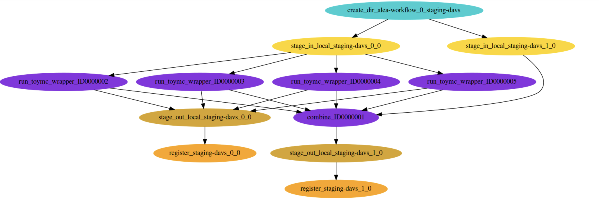

# Submitters
## HTCondor Submitter Tips
Contact for tech-support: [Lanqing Yuan](yuanlq@uchicago.edu)

This submitter will only work on OSG, assuming you are submitting from `ap23`. To use it, you have to be in XENONnT collaboration (since there are several XENON privillaged certificates involved in this submitter), and you should have finished the `ap23` setup [here](https://xe1t-wiki.lngs.infn.it/doku.php?id=xenon:xenonnt:analysis:guide#for_ci-connect_osg_service). No Grid Certificate (Computing experts only) is required.

### Setup
Please make sure you run this setup before submitting jobs, otherwise you will run into `Pegasus` related issues.
```
. setup_pegasus.sh
```
A typical setup script looks like this:
```
#!/bin/bash
# setup_pegasus.sh
# This script only works for XENONnT on ap23

. /cvmfs/xenon.opensciencegrid.org/releases/nT/development/setup.sh

# Copy the shared X509 proxy (same as the one used in midway)
cp /ospool/uc-shared/project/xenon/grid_proxy/xenon_service_proxy $HOME/.xenon_service_proxy
chmod 600 $HOME/.xenon_service_proxy

export X509_USER_PROXY=$HOME/.xenon_service_proxy
export PYTHONPATH=`pegasus-config --python`:$PYTHONPATH
```

### Configuration
Following this as an example
```
htcondor_configurations:
  template_path: "/ospool/uc-shared/project/xenon/binference_common/binference_common/nt_cevns_templates/v7"
  cluster_size: 1
  request_cpus: 4
  request_memory: 2000
  request_disk: 2000
  combine_disk: 20000
  dagman_maxidle: 100000
  dagman_retry: 2
  dagman_maxjobs: 100000
  combine_n_outputs: 100
  singularity_image: "/cvmfs/singularity.opensciencegrid.org/xenonnt/montecarlo:2024.04.1"
  workflow_id: "lq_b8_cevns_30"
```
- `template_path`: where you put your input templates. Note that **all files have to have unique names**. All templates inside will be tarred and the tarball will be uploaded to the grid when computing.
- `cluster_size`: clustering multiple `alea_run_toymc` jobs into a single job. For example, now you expect to run 100 individual `alea_run_toymc` jobs, and you specified `cluster_size: 10`, there will be only 10 `alea_run_toymc` in the end, each containing 10 jobs to run in sequence. Unless you got crazy amount of jobs like >200, I don't recommend changing it from 1.
- `request_cpus`: number of CPUs for each job. It should be larger than alea max multi-threading number, otherwise OSG will complains.
- `request_memory`: requested memory for each job in unit of MB. Please don't put a number larger than what you need, because it will significantly reduce our available slots.
- `request_disk`: requested disk for each job in unit of MB. Please don't put a number larger than what you need, because it will significantly reduce our available slots.
- `combine_disk`: requested disk for combine job in unit of MB. In most cases 20GB is enough.
- `dagman_maxidle`: maximum of jobs allowed to be idle. The default 100000 is good for most cases.
- `dagman_retry`: number of automatic retry for each job when failure happen for whatever reason. Note that everytime it retries, we will have new resources requirement `n_retry * request_memory` and `n_retry * request_disk` to get rid of failure due to resource shortage.
- `dagman_maxjobs`: maximum of jobs allowed to be running. The default 100000 is good for most cases.
- `combine_n_outputs`: number of toymc job to combine when concluding. Be cautious to put a number larger than 200 here, since it might be too risky...
- `singularity_image`: the jobs will be running in this singularity image.
- `workflow_id`: name of user's choice for this workflow. If not specified it will put the datetime as `workflow_id`.


### Usage
Make sure you configured the running config well, then you just simply pass `--htcondor` into your `alea_submission` command.

In the end of the return, it should give you something like this:
```
pegasus-status -l /scratch/yuanlq/workflows/lq_b8_cevns_30/runs
```
Keep this directory in mind, since all logs will go there and we call it "run directory"

### Useful Commands
To check the progress, you want to do `condor_q`. For example
```
(XENONnT_development) yuanlq@ap23:~$ condor_q


-- Schedd: ap23.uc.osg-htc.org : <192.170.231.144:9618?... @ 05/09/24 16:45:39
OWNER  BATCH_NAME                      SUBMITTED   DONE   RUN    IDLE   HOLD  TOTAL JOB_IDS
yuanlq xenonnt-0.dag+12972724         5/9  16:16   4155    114    288      _   5439 12972725.0 ... 12973919.0
yuanlq xenonnt-0.dag+12972825         5/9  16:16  15350    108     84      1  16622 12972933.0 ... 12973920.0
yuanlq alea-workflow-0.dag+12973662   5/9  16:35      4      3      _      _     11 12973684.0 ... 12973686.0
```

Here you see `alea-workflow-0.dag+12973662` is running.

To cancel it, you want to do:
```
condor_rm 12973662
```

If you want to check the status of jobs.
```
pegasus-status -l /scratch/yuanlq/workflows/lq_b8_cevns_30/runs
```

If you want to know more details, like checking why the job failed, just do this in your "run directory". This command should give you a summary of the workflow, including errors encountered if any.
```
pegasus-analyzer /scratch/yuanlq/workflows/lq_b8_cevns_30/runs
```

Let's say now the workflow is ended (you see nothing from `condor_q`). If it didn't finish successfully for weird error, a good thing to do is just to rerun it. However, keep in mind that the workflow itself will automatically retries up to `dagman_retry` times (defined in your running config). To rerun the failed jobs only, just do this.
```
pegasus-run /scratch/yuanlq/workflows/lq_b8_cevns_30/runs
```

To collect the final outputs, there are two ways
- Check your folder `/scratch/$USER/workflows/<workflow_id>/outputs/`. There should be a single tarball containing all toymc files and computation results.
- A redundant way is to get files from dCache, in which you have to use `gfal` command to approach. For example `gfal-ls davs://xenon-gridftp.grid.uchicago.edu:2880/xenon/scratch/yuanlq/lq_b8_cevns_30/` and to get the files, for example do `gfal-ls davs://xenon-gridftp.grid.uchicago.edu:2880/xenon/scratch/yuanlq/lq_b8_cevns_30/00/00/`. This contains both the final tarball and all `.h5` files before tarballing. To get them you want to do something like `gfal-copy davs://xenon-gridftp.grid.uchicago.edu:2880/xenon/scratch/yuanlq/lq_b8_cevns_30/00/00/lq_b8_cevns_30-combined_output.tar.gz . -t 7200` Note that this command works also on Midway/DaLI.

### Example Workflow
Here we only care about the purple ones, and the rest are generated by `Pegasus`.
- Each individual `run_toymc_wrapper` job is computing `alea_run_toymc`. For details what it is doing, see `run_toymc_wrapper.sh`.
- The `combine` job will just collect all outputs from the `run_toymc_wrapper` jobs, and tar them into a single tarball as final output.

